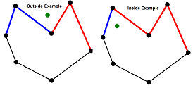

# Whiteboarding without Code

<!-- This should take about 35 minutes total..it took 45, but I think we can do better next time -->
<!--Took 45 again, I think that's just what it takes -->
<!--35 minutes for WDI5 -->

## Directions

Your task for this warm-up is:

- Split in pairs
- Have each member of the pair select a different exercise
- Take turns trying to solve the problem on the white board
  - You will have 10 minutes each
  - At the end of each problem, your partner will give you feedback
- Finally, we will discuss our solutions with the whole class

## Exercise 1: Egg Drop

A building has 100 floors. One of the floors is the highest floor an egg can be dropped from without breaking.

If an egg is dropped from above that floor, it will break. If it is dropped from that floor or below,
it will be completely undamaged and you can drop the egg again.

Given two eggs, find the highest floor an egg can be dropped from without breaking, with as few drops as possible.

## Exercise 2: Polygon

Given a polygon with an arbitrary number of vertices (3,4,5,...) like the one
pictured below and a point, also pictured below,
how would you determine if the point lies inside the polygon or outside the polygon?

